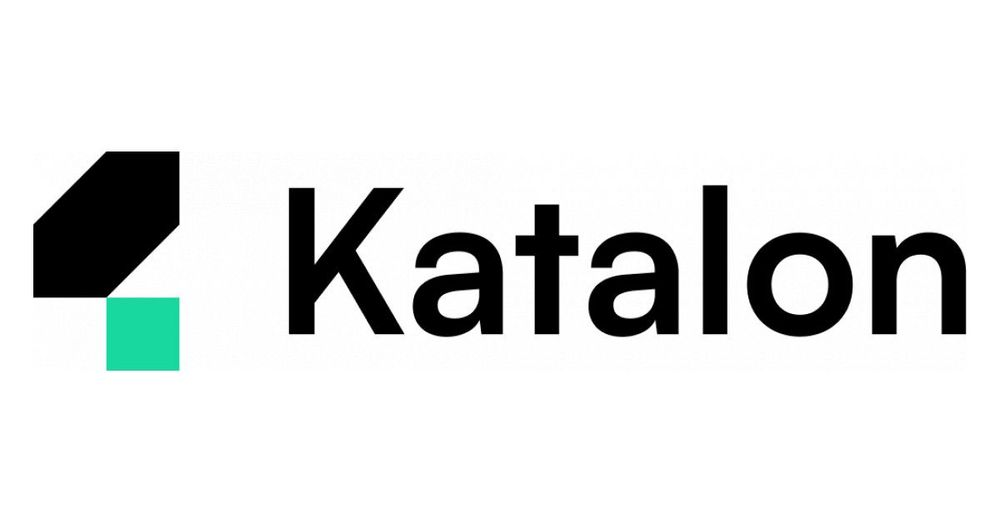
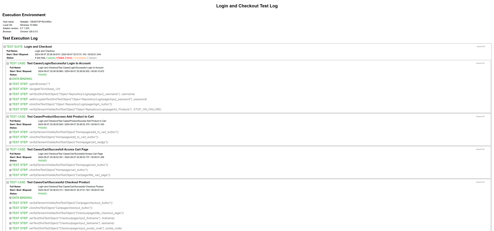

# Web Automation Testing Using Katalon on Saucedemo by Swag Labs

Repository for Learning Software Quality Assurance - Web Automation Using Katalon Studio

    

This is a personal project focused on practicing web automation testing on the Saucedemo website by Swag Labs using Katalon Studio. The goal of this project is to enhance skills in End-to-End (E2E) testing, covering critical user workflows such as login, adding items to the cart, accessing the cart, and completing the checkout process.

## 🚀 Project Overview

The project includes:

- **Successful Login to Account:** Automating the login process with valid of user credentials to validate access control.
- **Success Add Product to Cart:** Testing the functionality of adding products to the shopping cart.
- **Successful Access Cart Page:** Verifying the cart access to ensure the correct items are displayed and are ready for checkout.
- **Successful Checkout Product:** Completing the checkout process, which includes entering user information, validating the order summary, and confirming the purchase.

## Screenshot of Mochawesome Reporter

## 📌 Current Status

While the key workflows are successfully automated, the project is still a work in progress. Some test cases and additional refinements are planned to ensure a more comprehensive testing suite.

## 🛠️ Tools Used

- **Katalon Studio:** A powerful test automation tool used to create and execute test cases.
- **Saucedemo by Swag Labs:** The target website used for practicing web automation testing scenarios.

## 📈 Goals

- Enhance web automation skills using Katalon Studio.
- Improve understanding of E2E testing processes and best practices.
- Develop modular test cases to handle various user interactions and scenarios effectively.

## 🔗 Resources

- **Saucedemo by Swag Labs:** [Visit Website](https://www.saucedemo.com/)

## 🚧 Future Improvements

- Expand test coverage to include additional scenarios and edge cases.
- Refine the codebase for better structure and maintainability.
- Implement reporting and error handling enhancements.

Feel free to explore the project, contribute, or provide feedback!
